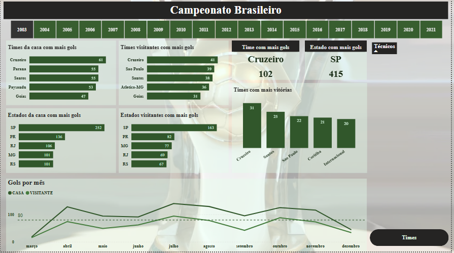
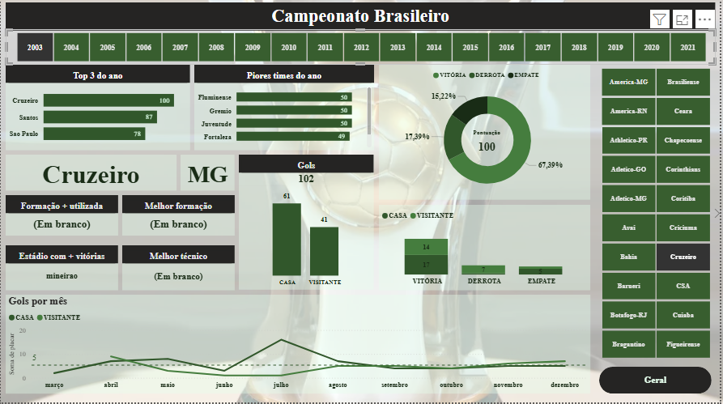

# Dashboar de Analise do Campeonato Brasileiro

O relatorio consiste na análise dos jogos do campeonato brasileiro. 
Este projeto é um dashboard interativo criado no Power BI para analisar dados históricos do Campeonato Brasileiro de Futebol. Ele foi desenvolvido para identificar tendências de desempenho de times e jogadores ao longo das temporadas.

Os dados utilizados neste projeto foram disponibilizados pelo professor. 

As principais ferramentas utilizadas foram: Power BI (para modelagem e visualização), SQL (para extração inicial dos dados) e Git/GitHub (para controle de versão e portfólio).

As análises permitiram identificar que o time X tem um desempenho superior em casa e que o jogador Y é o líder em assistências nas últimas vinte temporadas.

### Contato e Portfólio seguido de [Meu LinkedIn](https://www.linkedin.com/in/lucasvillarinhos)

